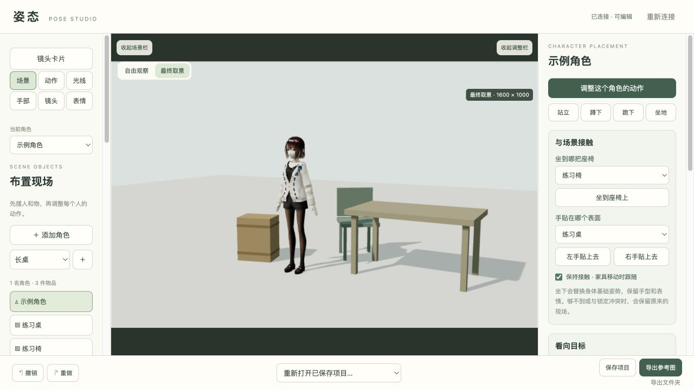
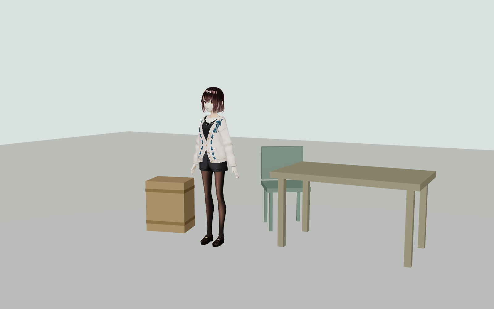
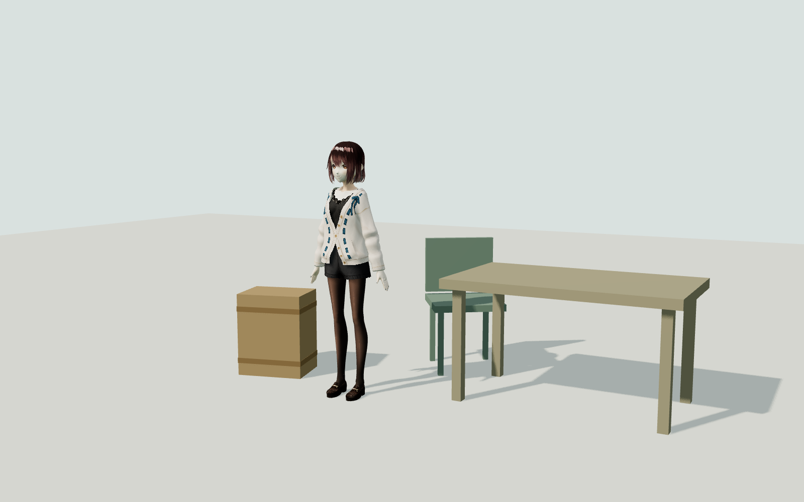

# 角色工作台 · Pose Studio

**先摆好人物、物品、灯光和镜头，再把参考图交给绘图 AI。**

一个在真实插画需求中逐步做出来的本地三维工作台。可以让能操作本机文件的 AI 助手先布置场景，再由你拖动微调；也可以完全手动使用。工作台负责空间和参考图，本身不内置聊天或图片生成模型。

Local 3D pose, scene, lighting and camera workbench for AI illustration references. Chinese UI, local storage, optional local-agent control.

[下载 Windows 便携版](https://github.com/Yunyou20xiya/pose-studio/releases/download/v0.16.0/PoseStudio-Windows-v0.16.0.zip) · [发布页](https://github.com/Yunyou20xiya/pose-studio/releases/tag/v0.16.0) · [完整使用说明](docs/USAGE.md) · [给 AI 的说明](给AI看的说明.md)



> 感谢 [ZaberKo/vrm-studio](https://github.com/ZaberKo/vrm-studio)、[ketle-man/comfyui-vrm-pose-editor](https://github.com/ketle-man/comfyui-vrm-pose-editor) 提供的参考，以及 [Three.js](https://github.com/mrdoob/three.js)、[pixiv/three-vrm](https://github.com/pixiv/three-vrm)、VRoid Project 等项目与作者。本项目包含开源组件和改编姿态，具体复用、参考范围、版本及许可见 **[参考项目与致谢](CREDITS.md)**。

## 三步开始

适用于 Windows 10 / 11 的普通 Intel / AMD x64 电脑，推荐新版 Edge 或 Chrome。

1. 从上面的链接下载 **PoseStudio-Windows-v0.16.0.zip**，右键选择“全部解压”。
2. 打开解压后的文件夹，双击 **Start-Workbench.cmd**，浏览器会自动打开。
3. 保持启动窗口打开，在工作台里调整场景，保存项目或导出参考图。关闭启动窗口即可停止。

便携包已经带上运行程序和示例模型，不需要安装 Node.js、Python、Blender 或 ComfyUI，首次启动也不需要联网下载模型。不要在 ZIP 内部直接运行。GitHub 自动生成的“Source code”压缩包是源码，不是包含运行程序的便携版。

浏览器没有自动打开时，将启动窗口显示的网址复制到浏览器。每台电脑的端口可能不同，以自己的窗口为准。

## 能做什么

- **人物与动作**：多角色摆位，基础姿势，身体关节调整，站立、蹲下、跪下、坐地与座椅接触。
- **手部与表情**：左右手与指型、双手接触、手部特写、头部方向、视线和闭眼。
- **物品与环境**：桌椅、箱子、建筑块及水族馆物件，位置、尺寸和组合调整。
- **灯光与镜头**：灯位、强度、环境补光、圆形/方形发光面与光斑、取景位置和焦距。
- **镜头卡片与保存**：保存完整现场，切换镜头，撤销与重做，重新打开项目。
- **AI 参考包**：同一机位的正常光、目标打灯、体块、深度、对象分色和手脸局部图，附可恢复的场景文件。

## 为什么导出两张主参考

| 正常光：看清姿势、原色和遮挡 | 打灯后：表达最终受光与投影 |
| --- | --- |
|  |  |

两张来自同一场景、同一机位；图像模型如何遵守参考，仍取决于所用模型和实际生成结果。深度与分色图需要接入支持它们的流程，不会自动成为通用图像模型的硬约束。

## 让 AI 先搭，再由你调整

启动工作台，保持编辑页面打开，让能读写本机文件、运行命令的 AI 助手（例如本地 Codex）打开这个文件夹，阅读 [给AI看的说明.md](给AI看的说明.md)。

你可以描述：“布置两个人交谈的场景，旁边放两把椅子；先给我看取景。”助手可通过本地场景指令执行，再由你检查和微调。普通网页聊天不能直接控制本机工作台；外部 AI 的账户、费用和使用授权由使用者自行选择。

## 文件放在哪里

| 内容 | 工作台文件夹内的位置 |
| --- | --- |
| 单张参考图 | `导出/` |
| AI 参考包 | `导出/AI参考包/` |
| 项目、镜头与编辑记录 | `local-data/` |
| 全新入门场景 | `examples/starter.pose.json` |

换位置或备份时，先关闭启动窗口，再复制整个文件夹。更新前备份 `local-data` 和 `导出`，避免覆盖自己的作品。

## 当前范围

这是个人兴趣项目的首次公开试用版，按实际需求更新，欢迎反馈和贡献。

- 目前围绕固定示例 VRM 模型调校；多个角色是该模型的独立副本，尚无通用的模型导入向导。
- 接触与关节限制用于辅助摆姿，复杂姿态仍可能穿模；没有完整的皮肤碰撞和布料模拟。
- 实时灯光用于构图和受光参考，不能替代物理渲染器。
- 预览最高约 30 帧、1 倍显示像素，导出仍按镜头尺寸。集显建议先从 1 个角色和少量物品开始；需要 WebGL 2，实际性能取决于显卡和驱动。
- Windows 便携运行时来源与哈希已核对；浏览器图形表现仍需要在不同 Windows 设备上试用。
- 部分早期参考动作禁止再分发，公开版只带 7 个允许分发的动作预设。手动指型、站蹲跪坐和自有组合功能仍保留。

## 从源码运行

Windows、macOS 或 Linux 上安装 Node.js 22.12 或更新版本，然后在项目目录执行：

```bash
npm ci
npm run build
npm test
npm start
```

`npm start` 会启动本机服务并打开浏览器。源码包含可分发的示例模型与姿态，服务仅监听 `127.0.0.1`。`npm run dev` 用于前端开发；普通使用优先采用上面的构建启动流程。

自动检查范围见 [docs/TESTING.md](docs/TESTING.md)。命令行助手通过 `node scripts/pose-command.mjs --scene` 读取现场；提交命令需要活跃的浏览器编辑会话。

## 参考、许可与反馈

- [参考项目与致谢](CREDITS.md)：来源项目、固定提交、具体参考功能、改编动作与作者署名。
- [第三方素材说明](第三方素材说明.md) 与 [licenses](licenses/)：模型、依赖和动作的独立条款。
- 本项目新增代码使用 [MIT License](LICENSE)；模型与第三方内容继续遵守各自许可。
- [提交问题](https://github.com/Yunyou20xiya/pose-studio/issues)：请附系统、浏览器、操作步骤和报错。上传截图前遮住个人路径；不要附连接令牌或私人项目。
